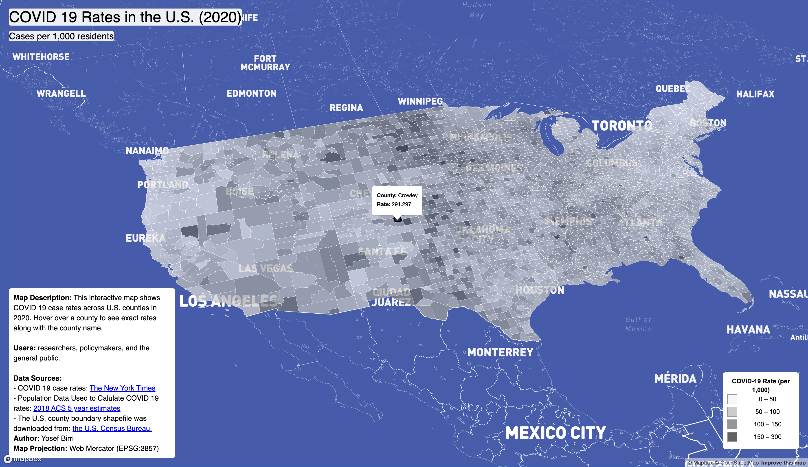

# Interactive COVID-19 Maps of the U.S. (2020)

## Project Overview
This project will show the visualizations of county level COVID-19 data in the United States during 2020. It has **two interactive maps**:

1. **COVID 19 Rates Map** – a choropleth map showing the number of cases per 1000 residents per county.
2. **COVID 19 Case Counts Map** – a proportional symbols map that shows the total confirmed cases per county, with circle sizes proportional to case counts.

Both maps are interactive: hovering over a county or symbol displays county name and case count or rate depending on the map on view, and users can explore patterns geographically.

---

## Live Maps
- **Rates Map:** [COVID 19 Rates Map](https://yosefbirri.github.io/Covid-19-Mapped/map1.html)
- **Counts Map:** [COVID 19 Counts Map](https://yosefbirri.github.io/Covid-19-Mapped/map2.html)

---

## Map Preview

*Figure 1: COVID 19 Rates per 1000 residents (Choropleth Map)*

*Figure 2: COVID 19 Case Counts (Proportional Symbols Map)*

---

## Primary Functions
- **Interactive Hover:** When hovering over a county or point, a popup shows the **county name** and **case counts or rates**.
- **County Highlighting (Choropleth Map):** The county boundary under the cursor is highlighted for easy identification.
- **Proportional Symbols:** For the counts map, the circle sizes scale dynamically based on case counts, providing visual weight to larger outbreaks.
- **Custom Legend:** Dynamic legends for both choropleth and proportional symbol maps, showing meaningful intervals and colors or circle sizes.

---

## Libraries Used
- [Mapbox GL JS](https://docs.mapbox.com/mapbox-gl-js/) – for interactive web mapping.
- Vanilla JavaScript and CSS: For webdevelopment

---

## Data Sources
- **COVID-19 County-Level Data:** [CDC COVID-19 Data](https://data.cdc.gov/) (2020)
- **U.S. Counties GeoJSON:** Publicly available shapefiles and converted GeoJSON for mapping boundaries and centroids.

---

## Credit & Acknowledgment
- Project developed by **Yosef Birri**
- Thanks to Professor **Bo Zhao** and people who were involved in the development of this project.
- Thanks to the CDC for providing the COVID 19 data.

---

## Notes
- Both maps use **Albers USA projection**
